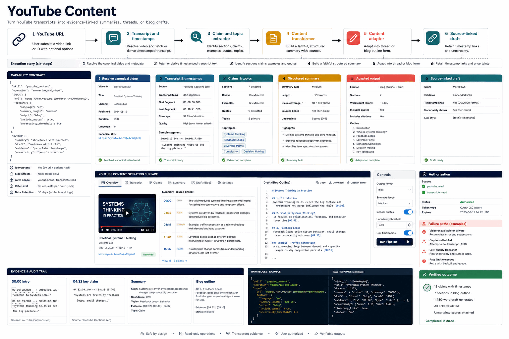

# How YouTube Content Works

Turn YouTube transcripts into evidence-linked summaries, threads, or blog drafts.

## Stages

### 1. Resolve the canonical video and metadata

**Primary surface:** `YouTube URL`

Record the input, operation, observable output, and any decision that changes scope. Stop here if the output is missing, contradictory, or insufficient for the next stage.
### 2. Fetch or derive timestamped transcript text

**Primary surface:** `Transcript and timestamps`

Record the input, operation, observable output, and any decision that changes scope. Stop here if the output is missing, contradictory, or insufficient for the next stage.
### 3. Identify sections claims examples and quotes

**Primary surface:** `Claim and topic extractor`

Record the input, operation, observable output, and any decision that changes scope. Stop here if the output is missing, contradictory, or insufficient for the next stage.
### 4. Build a faithful structured summary

**Primary surface:** `Content transformer`

Record the input, operation, observable output, and any decision that changes scope. Stop here if the output is missing, contradictory, or insufficient for the next stage.
### 5. Adapt into thread or blog form

**Primary surface:** `Source-linked draft`

Record the input, operation, observable output, and any decision that changes scope. Stop here if the output is missing, contradictory, or insufficient for the next stage.
### 6. Retain timestamp links and uncertainty

**Primary surface:** `Source-linked draft`

Record the input, operation, observable output, and any decision that changes scope. Stop here if the output is missing, contradictory, or insufficient for the next stage.

## Failure handling

- **Authorization failure:** do not probe credentials or broaden access; report the missing authority.
- **Target ambiguity:** stop before mutation and request the minimum identifying information.
- **Tool or service failure:** retain error evidence, retry only safe transient failures, and cap retries.
- **Verification failure:** classify the run as incomplete even when the preceding operation returned success.

## Completion evidence

The handoff should contain the original request, inspection state, preview or plan, exact execution result, direct verification, and a final receipt naming limitations and withheld actions.
